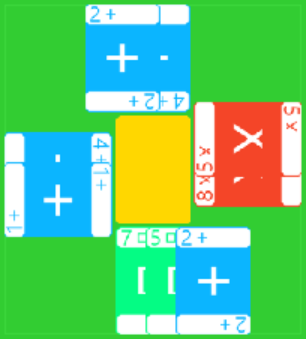

# Krig – et kjapt kortspill for den krigerlystne

Du står som general overfor en storskala *krig*. Mot tre andre nasjoner skal du lede hærene din ut i slag i håp om å vinne. Tiden er inne for å bevise at du virkelig er den strategen du har påstått at du er.

### Kom i gang

1. Installer avhengigheter:
```bash
pip install -r requirements.txt
``` 
2. Start spillet!
```bash
python start.py
```

*Tips: Spillet guider deg med visuelle hjelpeeffekter.*


## Spilleregler

*Ta gjerne en kjapp titt på spillet først. Det er ofte enklere å lære slik.*

Krig er et spill der målet er å vinne slag. Hver seier gir ett **seierpoeng**. Spillerne disponerer store hærstyrker, men hver hær kun brukes i ett slag. Spillets dilemma er hvordan styrkene skal fordeles. Det hjelper lite å vinne stort i ett slag, hvis resten går tapt.

### Spillets gang

1. **Oppsett**: Alle spillere begynner med **3** kort. Resten av kortene utgjør trekkbunken. En spiller velges til å begynne.
2. **Spillet**: 
   - Spilleren i tur utfører de handlingene vedkommende ønsker. Spilleren kan også velge å ikke foreta seg noe.
   - Til slutt trekker spilleren 2 spillekort, men maksimalt slik at vedkommende har 6 kort på hånden. Turen går videre til nestemanns tur, i klokkevis retning.<br>**Sluttfase**: At trekkbunken er tom markerer spillets sluttfase. Fra og med nå vil spillere som i løpet av turen ikke reduserer antall kort på hånden anses som ferdige. Dette var deres siste runde. Spillet fortsetter til alle er ferdige.
2. **Ved endt spill**:  Spilleren(e) med flest slagkort vinner. Slag som ligger igjen på bordet telles ikke med.

### Handlinger

I løpet av turen kan du foreta deg følgende handlinger:
<ul>
<li> <strong>Innled slag</strong>: Spill et *slagkort* på **slagmarken** din (foran hånda). Her vil den ligge inntil den er **vunnet**. En spiller kan maksimalt ha 3 pågående slag på slagmarken sin.<br>
 <br>
 
</li>

<li><strong>Angrip</strong>, <strong>Forsvar</strong> eller <strong>Forsterk</strong>: Spill <ul>
   <li>et forsvarskort til et eget slag,</li>
   <li>et angrepskort til en motspillers slag,</li>
   <li><em>eller</em> et forsterkningskort til et eget eller en motspillers slag.
   <br><br>
  <table>
  <tr>
    <td>
      
    </td>
    <td>
      
    </td>
    <td>
      
    </td>
  </tr>
  </table>
   </ul>
   
   Merk at du kan supplementere med flere kort, men kun hvis valøren er **mindre eller lik** den forrige.<br>
   </li>
  <li><strong>Erklær seier</strong>: Hvis du har flertall hærstyrker på et slag når turen din begynner, kan du erklære seier. Se bildet nedenfor. Dette gjør du ved å ta slagkortet og legge den åpen ved siden av spillehånden din. Hærstyrkene som ligger igjen settes i kastebunken.<br>
  <br>
  
  <br>
  <br>
  <em>NB</em>: Du kan kun ta slagkort i starten av turen din. Skulle du glemme å ta et slagkort må du vente til neste runde, om sjansen skulle by seg.
  <br>
  <br>
  </li>

  <li><strong>Forkast kort</strong>: Du kan kvitte deg med et kort ved å plassere det i kastebunken. Kortet er  da ute av bruk.
  </li>
</ul>
